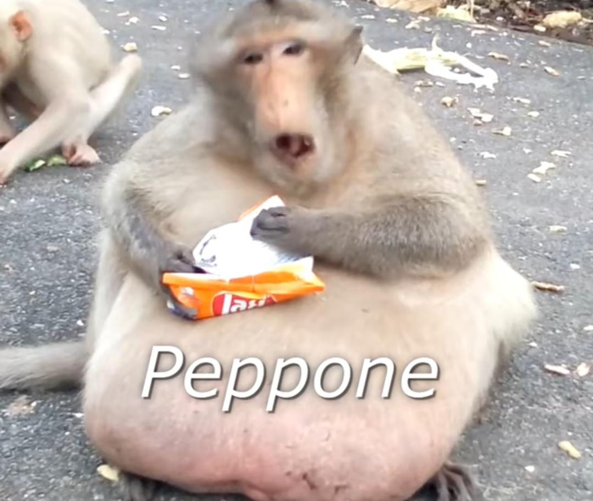

# MonkeyCleaner

Peppone, la scimmia che mangia le banane :banana: :palm_tree:

## Installazione

Per prima cosa è necessario effettuare il colne della repository con il seguente comando:

``` sh
git clone https://github.com/Typing-Monkeys/MonkeyCleaner.git
cd MonkeyCleaner
git lfs pull
```

Git LFS serve per poter scaricare il dataset in quanto supera le dimenzioni massime per poter essere caricato su GitHub. Per dubbi [Git LFS](https://git-lfs.github.com/)

Per far funzionare questo progetto bisogna:

* Installare python e le librerie necessarie
* Installare Aima-Python

### Dipendenze

Il tutto è stato testato sulla versione di python `3.8.6`.<br>
Per installare le varie dipendenze utilizzare il seguente comando: 

`pip install -r requirements.txt`.

### Aima-Python

Una volta installata la libreria [Aima-Python](https://github.com/aimacode/aima-python.git) va copiata all'interno della cartella del progetto e rinominata come `aima-python`. Alla fine il contenuto della cartella del progetto deve essere:


```
./MonkeyCleaner
    │
    ├ ...
    ├ aima-python
    ├ main.py
    ├ ...
```

## Descrizione Script Eseguibili

Di seguito una breve spiegazione e lista degli script eseguibili:

* `main.py`: lo script principale che serve per avviare l'intero progetto. Accetta i seguenti argomenti:
    * `--ann`: esegue la classificazione tramite ANN
    * `--knn`: esegue la classificazione tramite KNN
    
* `annTraining.py`: script utilizzato per la fase di allenamento dell'ANN. Alla fine dalla procedura salva un file `.h5` che contiene il modello allenato. 
Accetta i seguenti argomenti:
    * `-Mtraining`: allena il modello con difersi batch ed epoche prestabilite
    * `annTraining.py <batch_size> <epoche>`: allena il modello utilizzando la dimenzione dei batch e il numero delle epoche scelte dall'utente

* `evaluate.py`: script utilizzato per la fase di testing dei modelli. Accetta i seguenti argomenti:
    * `--ann`: effettua la valutazione del modello ANN
    * `--knn`: effettua la valutazione del modello KNN utilizzando diversi valori di K

* `datasetTrimmer.py`: script utilizzato per creare un sottodataset partendo dal dataset principale [A_Z Handwritten Data](https://www.kaggle.com/sachinpatel21/az-handwritten-alphabets-in-csv-format). Necessita di questo dataset nella sua stessa cartella.


## Avviare il progetto

Per avviare il progetto utilizzare uno dei seguenti comandi:

```sh
python main.py --ann
python main.py --knn
```

**Importante**: durante la fase di acquisizione della foto si possono usare i seguenti comandi:

* `BARRA SPAZIATRICE` per acquisire la foto.
* `ESC` per continuare lo script. Se non si è acquisita una foto lo script viene interrotto, alrtimenti continua con il classifciatore scelto.

## Descrizione dei restanti files e cartelle

* `Animation_imgs`: contiene le immagini per stampare la ricerca a video con animazione :rocket:
* `Dtaset_Artista`: contiene alcune immagini utilizzate nelle prime fasi di test per comprendere il comportamente del Classificatore
* `docker`: contiene il Dockerfile utilizzato per l'allenamento dell'ANN
* `Models`: contiene i modelli dell'ANN
* `Valutazioni`: contiene i risultati della fase di testing dei classificatori ANN e KNN
* `Animation.py`: classe che implementa l'animazione grafica
* `ann.py`: file contenente funzioni per la realizzazione, training e testing del modello ANN
* `imgUtils.py`: funzioni per acquisizione e elaborazione delle immagini prima di essere passate al Classificatore
* `knn.py`: funzioni per realizzazione, training e testing del modello KNN
* `Monkey.py`: classe che rappresenta il problema
* `pathFinding.py`: funzioni per la realizzazione della ricerca Informata e Non Informata
* `trimmedData.csv`: dataset contenente solo le lettere utilizzate nelle varie tabelle


## La Storia



Questa è la storia di una scimmia, ma non una scimmia qualunque, è una scimmia che è partita dal niente ed è riuscita a coronare i suoi sogni.<br>
Peppone, così si chiamava, ed io l'ho conosciuto quando ancora coltivava tutto nudo delle banane nel suo umile giardino, da generazioni la sua famiglia aveva vissuto in quella catapecchia, e lui per tutta la vita aveva conosciuto solo la fame.<br>
Peppone però era un sognatore e, guardando quel giallore giorno dopo giorno, incominciò ad averne abbastanza di quella vita (non delle banane, le banane non bastano mai!).<br>
Un giorno decise di prendere in mano il suo fututro e cercare fortuna in un mondo a lui sconosciuto, quello delle criptovalute.<br>
Fu una scelta azzeccata e ben presto Peppone diventò miliardario :moneybag: :monkey:.<br>
Ben presto presto si ritrovò a vivere in un lussuoso appartamento scandinavo (Per Peppone non ci sono compromessi, o lusso o povertà !), ma sentiva come un vuoto dentro... LE BANABE :banana:!!!<br>
Così ogni mattina Peppone si svegia e va per il vicinato alla ricerca di banane che mangia con gioia ripensando al sostentamento che gli hanno dato durante la sua ascesa al potere.<br>

E poi va a letto.
